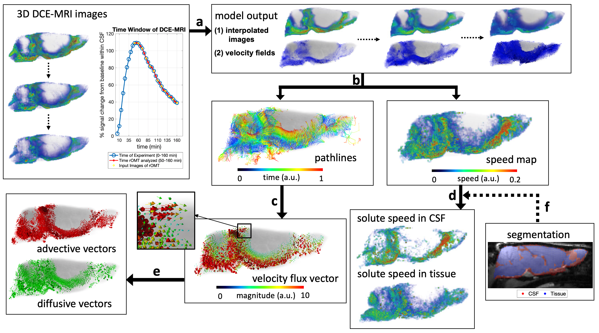

# Regularized Optimal Mass Transport (rOMT) Applied in Glymphatic-Lymphatic fluid flows 
This project includes code for <br />
(1) rOMT algorithm <br />
(2) Lagrangian representation of Glymphatic Dynamics (GLaD) analysis <br />
(3) Neighborhood-based Cosine Analysis (NCA) <br />

where (1) runs the main rOMT model on the dataset and (2-3) post-processes the results from (1).



## System Requirements
The code was mainly written and ran in Matlab (R2018a for rOMT algorithm and R2019b for post-processing), with a small section in GLaD analysis ran with Python 3.7.3. 

### Dependencies
#### Matlab
(a) NIfTI_analyze https://www.mathworks.com/matlabcentral/fileexchange/8797-tools-for-nifti-and-analyze-image for loading and exporting nifty files <br />
(b) vtkwrite https://www.mathworks.com/matlabcentral/fileexchange/47814-vtkwrite-exports-various-2d-3d-data-to-paraview-in-vtk-file-format for exporting mat to vtk format <br />
#### Python
numpy, scipy, dipy
#### Recommended Software for Visualization
(a) Amira 6.5.0 for speed map (may require purchase)<br />
(b) VisIt 3.0.2 for flux vectors (open source)<br />

## Demo
The original 3D MRI dataset (each of size 100x106x100 and in total 11 frames) is too time and memory-consuming to run on a typical desktop computer, so usually we put it on a CPU cluster with 40 cores. Even though it may lose lots of details and information, for the purpose of demonstration, we downsized the original sample data by 0.5 and reduced the data frames to 7. It takes about 70 minutes to run the sample data with default parameters on a computer with 2.6 GHz Intel Core i7 and 16 GB memory. <br />

### Instructions

To run the rOMT algorithm:<br />
(1) Set data directory, model parameters etc. in ```getParams.m```. You can skip this step by using the default parameters within.<br />
(2) Run ```driver.m```.<br />

You are expected to see output like the following (subject to changes dependent on the paramters in ```getParams.m```):<br />
```
=============== rOMT Starts ===============
______________________________________________

 tag:		C294
 dataset:	CAA
 sigma:		0.0020
 gamma:		0.0080
 beta:		0.0001
 nt:		10
 dt:		0.40
 pcg:		20
 mask:		1
 do_resize:	1
 resize_factor:	0.50
 start frame:	31
 end frame:	52
 frame jump:	3
 
 tind = 1
 =============== Descent on u ===============
______________________________________________

i.lsiter	phi    	      descent output
________    ___________     __________________
  1.0	      1.15e+06 	     ||g|| = 2.78e+05       
  1.1	      1.15e+06 	     phit  = 8.67e+05        
  2.0	      8.67e+05 	     ||g|| = 1.92e+05       
  2.1	      8.67e+05 	     phit  = 5.81e+05        
  3.0	      5.81e+05 	     ||g|| = 1.27e+05       
  3.1	      5.81e+05 	     phit  = 5.16e+05        
  4.0	      5.16e+05 	     ||g|| = 1.13e+05       
  4.1	      5.16e+05 	     phit  = 4.40e+05        
  5.0	      4.40e+05 	     ||g|| = 1.15e+05       
  5.1	      4.40e+05 	     phit  = 4.13e+05        
  6.0	      4.13e+05 	     ||g|| = 1.04e+05       
  6.1	      4.13e+05 	     phit  = 3.81e+05        
tind = 1, max(u) = 1.8661
tind = 2
 =============== Descent on u ===============
______________________________________________

i.lsiter	phi    	      descent output
________    ___________     __________________
  1.0	      1.24e+06 	     ||g|| = 2.12e+05       
  1.1	      1.24e+06 	     phit  = 1.01e+06        
  2.0	      1.01e+06 	     ||g|| = 1.55e+05       
  2.1	      1.01e+06 	     phit  = 7.03e+05        
  3.0	      7.03e+05 	     ||g|| = 1.04e+05        
  3.1	      7.03e+05 	     phit  = 6.19e+05        
  4.0	      6.19e+05 	     ||g|| = 9.14e+04       
  4.1	      6.19e+05 	     phit  = 5.32e+05        
  5.0	      5.32e+05 	     ||g|| = 7.55e+04       
  5.1	      5.32e+05 	     phit  = 4.87e+05        
  6.0	      4.87e+05 	     ||g|| = 7.42e+04       
  6.1	      4.87e+05 	     phit  = 4.51e+05        
tind = 2, max(u) = 1.7551     
```
...
```
tind = 7
 =============== Descent on u ===============
______________________________________________

i.lsiter	phi    	      descent output
________    ___________     __________________
  1.0	      8.96e+05 	     ||g|| = 1.40e+05       
  1.1	      8.96e+05 	     phit  = 7.80e+05        
  2.0	      7.80e+05 	     ||g|| = 7.08e+04       
  2.1	      7.80e+05 	     phit  = 5.72e+05        
  3.0	      5.72e+05 	     ||g|| = 4.31e+04 
  3.1	      5.72e+05 	     phit  = 5.25e+05        
  4.0	      5.25e+05 	     ||g|| = 3.27e+04       
  4.1	      5.25e+05 	     phit  = 4.78e+05        
  5.0	      4.78e+05 	     ||g|| = 2.64e+04       
  5.1	      4.78e+05 	     phit  = 4.34e+05        
  6.0	      4.34e+05 	     ||g|| = 2.34e+04   
  6.1	      4.34e+05 	     phit  = 3.95e+05        
tind = 7, max(u) = 3.1690

 =============== rOMT Ends ===============

 Elapsed Time: 01:12:45  
```

To run post-processing:<br />
(1) Set directory in ```getParams.m```. Skip this step if you are processing the same rOMT output from the previous section.<br />
(2) Run ```getGLAD.m```.<br />


The paramters and instructions for running on the original large dataset can be found in getParams_original.m and the whole dataset can be available upon request.

