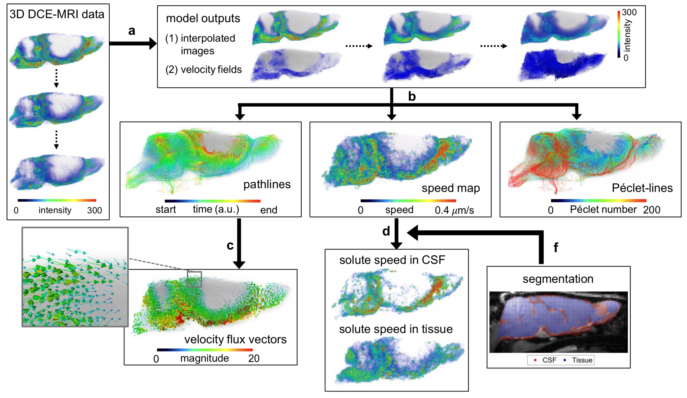
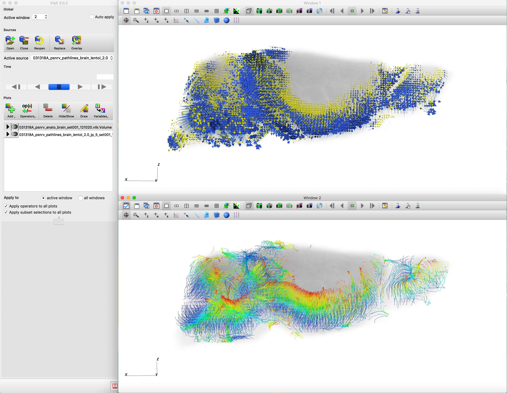

# Regularized Optimal Mass Transport (rOMT) Applied in Glymphatic-Lymphatic fluid flows 
This project includes code for <br />
(1) rOMT algorithm <br />
(2) Lagrangian representation of Glymphatic Dynamics (GLaD) analysis <br />
(3) Neighborhood-based Cosine Analysis (NCA) <br />

where (1) runs the main rOMT model on the dataset and (2-3) post-processes the results from (1).



## System Requirements
The code was mainly written and ran in Matlab (R2018a for rOMT algorithm and R2019b for post-processing), with a small section in GLaD analysis ran with Python 3.7.3. 

### Dependencies
#### Matlab
(a) NIfTI_analyze https://www.mathworks.com/matlabcentral/fileexchange/8797-tools-for-nifti-and-analyze-image for loading and exporting nifty files <br />
(b) vtkwrite https://www.mathworks.com/matlabcentral/fileexchange/47814-vtkwrite-exports-various-2d-3d-data-to-paraview-in-vtk-file-format for exporting mat to vtk format <br />
#### Python
numpy, scipy, dipy
#### Recommended Software for Visualization
(a) Amira 6.5.0 for speed map (may require purchase)<br />
(b) VisIt 3.0.2 for flux vectors (open source)<br />

## Demo
The original 3D MRI dataset (each of size 100x106x100 and in total 11 frames) is too time and memory-consuming to run on a typical desktop computer, so usually we put it on a CPU cluster with 40 cores. Even though it may lose lots of details and information, for the purpose of demonstration, we downsized the original sample data by 0.5 and reduced the data frames to 7. It takes about 70 minutes to run the sample data with default parameters on a computer with 2.6 GHz Intel Core i7 and 16 GB memory. <br />

### Instructions

To run the rOMT algorithm:<br />
(1) Set data directory, model parameters etc. in ```getParams.m``` and set the same tag name in line 6 of ```driver.m```. You can skip this step by using the default parameters and tag name within.<br />
(2) Run ```driver.m```.<br />

You are expected to see output like the following (subject to changes dependent on the paramters in ```getParams.m```):<br />
```
=============== rOMT Starts ===============
______________________________________________

 tag:		C294
 dataset:	CAA
 sigma:		0.0020
 gamma:		0.0080
 beta:		0.0001
 nt:		10
 dt:		0.40
 pcg:		20
 mask:		1
 do_resize:	1
 resize_factor:	0.50
 start frame:	31
 end frame:	52
 frame jump:	3
 
 tind = 1
 =============== Descent on u ===============
______________________________________________

i.lsiter	phi    	      descent output
________    ___________     __________________
  1.0	      1.15e+06 	     ||g|| = 2.78e+05       
  1.1	      1.15e+06 	     phit  = 8.67e+05        
  2.0	      8.67e+05 	     ||g|| = 1.92e+05       
  2.1	      8.67e+05 	     phit  = 5.81e+05        
  3.0	      5.81e+05 	     ||g|| = 1.27e+05       
  3.1	      5.81e+05 	     phit  = 5.16e+05        
  4.0	      5.16e+05 	     ||g|| = 1.13e+05       
  4.1	      5.16e+05 	     phit  = 4.40e+05        
  5.0	      4.40e+05 	     ||g|| = 1.15e+05       
  5.1	      4.40e+05 	     phit  = 4.13e+05        
  6.0	      4.13e+05 	     ||g|| = 1.04e+05       
  6.1	      4.13e+05 	     phit  = 3.81e+05        
tind = 1, max(u) = 1.8661  
```
...
```
tind = 7
 =============== Descent on u ===============
______________________________________________

i.lsiter	phi    	      descent output
________    ___________     __________________
  1.0	      8.96e+05 	     ||g|| = 1.40e+05       
  1.1	      8.96e+05 	     phit  = 7.80e+05        
  2.0	      7.80e+05 	     ||g|| = 7.08e+04       
  2.1	      7.80e+05 	     phit  = 5.72e+05        
  3.0	      5.72e+05 	     ||g|| = 4.31e+04 
  3.1	      5.72e+05 	     phit  = 5.25e+05        
  4.0	      5.25e+05 	     ||g|| = 3.27e+04       
  4.1	      5.25e+05 	     phit  = 4.78e+05        
  5.0	      4.78e+05 	     ||g|| = 2.64e+04       
  5.1	      4.78e+05 	     phit  = 4.34e+05        
  6.0	      4.34e+05 	     ||g|| = 2.34e+04   
  6.1	      4.34e+05 	     phit  = 3.95e+05        
tind = 7, max(u) = 3.1690

 =============== rOMT Ends ===============

 Elapsed Time: 01:12:45  
```

To run post-processing:<br />
(1) Set directory in ```getParams.m```. Skip this step if you are processing the same rOMT output from the previous section.<br />
(2) Set the tag name you want to process in line 10 of ```getGLAD.m```. Skip this step if you are running in default.<br />
(3) Run ```getGLAD.m```.<br />

You are expected to see output like the following (subject to changes):<br />
```
 =============== Post-processing Starts ===============
_________________________________________________________


=== What result do you want to extract? === 
Type "s" for speed map, "v" for flux vectors, "b" for both. 
Then press Enter to continue
```
Follow the instructions to choose what post-processing result you would like to run.<br />

Type 1: For speed map, you will need to run a script of Python, before which you will see output like:
```
Lagrangian-Pathline (C294 data, mask = 1, affSmooth = 1, dilate = 3), 
analysis type = speedmap
 
flw_type = vel, img = R, mdt = 10(T), altSPmsk0, spErode = 0, spDilate = 0, nEulStep= 1, 
cutoffStr = min, concThresh = 0.0001, spdThresh = 0.0001, minIm0 = 0, spDISTordered-fs5, slTol = 2, 
clusters, centroid = 0, nbp = 124, metric = AvgPwEuc, qbthresh = 4, clusTol = 12, clusCutoff = 600, 
diff = 2e3, tj = 3, nt= 10_dpsnrv_min_12_set001_032821

t = 1 (t1 = 31, t2 = 1 -> T = 31.000)
t = 2 (t1 = 31, t2 = 2 -> T = 31.300)
t = 3 (t1 = 31, t2 = 3 -> T = 31.600)
t = 4 (t1 = 31, t2 = 4 -> T = 31.900)
t = 5 (t1 = 31, t2 = 5 -> T = 32.200)
```
...
```
t = 66 (t1 = 49, t2 = 6 -> T = 50.500)
t = 67 (t1 = 49, t2 = 7 -> T = 50.800)
t = 68 (t1 = 49, t2 = 8 -> T = 51.100)
t = 69 (t1 = 49, t2 = 9 -> T = 51.400)
t = 70 (t1 = 49, t2 = 10 -> T = 51.700)
 # of start points = 1927
 # of effective pathlines after pathline-number (pln) threshold = 1921 
 # of effective pathlines after Euclidean dist (sl_tol) threshold = 1771

======= waiting to run run_dipyQB_pl.py =======

Instructions:

pl_cur.mat has been saved at the current directory.
Directly run run_dipyQB_pl.py with Python also in this directory.
Results will be saved automatically.
Then come back to Matlab and press any key to continue.
```
Run ```run_dipyQB_pl.py``` by following the instructions and next you will see:
```
...Matlab code sucessfully continues...
 # of original clusters = 89
 # of clusters after cluster-length (clus_tol) threshold = 44
 # of clusters after max-cluster-number (clus_cutoff) threshold = 44
Speed Map in nifty format saved in ../rOMT/test_results/C294/diff_2e3_mask_1_tj_3_dt_0.4_nt_10_ti_31_tf_49_uini_0_rini_none_beta_0.0001_R_gamma_0.008_correctHu_dtri1_tinterp0_rmin0_rnorm0_rsmooth1_rreinit0_source0_dilate3_pcg20/LPPA_set001_032821
```
A 3D rendering of the speed map will be plotted in Matlab, and a file in nifty format will be saved into the above directory which could be best visualized in Amira. <br />

Type 2: For flux vectors, you will see output like:
```
Lagrangian-Pathline (C294 data, mask = 1, affSmooth = 1, dilate = 3), 
analysis type = vectors
 
flw_type = vel, img = R, mdt = 10(T), altSPmsk0, spErode = 0, spDilate = 0, nEulStep= 1, 
cutoffStr = min, concThresh = 0.0001, spdThresh = 0.0001, minIm0 = 0, spDISTordered-fs1, slTol = 2, 
NNnum_tol_20_||_stdcut_0.50_wmeancut_[0.50,1.00]_Npcut_1_Avepathlcut_8.0
NNnum_tol_10_||_stdcut_0.40_wmeancut_[0.60,1.00]_Npcut_1_Avepathlcut_10.0|pathlcut_10.0
diff = 2e3, tj = 3, nt = 10_set002_032821

t = 1 (t1 = 31, t2 = 1 -> T = 31.000)
t = 2 (t1 = 31, t2 = 2 -> T = 31.300)
t = 3 (t1 = 31, t2 = 3 -> T = 31.600)
t = 4 (t1 = 31, t2 = 4 -> T = 31.900)
t = 5 (t1 = 31, t2 = 5 -> T = 32.200)
```
...
```
t = 66 (t1 = 49, t2 = 6 -> T = 50.500)
t = 67 (t1 = 49, t2 = 7 -> T = 50.800)
t = 68 (t1 = 49, t2 = 8 -> T = 51.100)
t = 69 (t1 = 49, t2 = 9 -> T = 51.400)
t = 70 (t1 = 49, t2 = 10 -> T = 51.700)
 # of start points = 12463
 # of effective pathlines after pathline-number (pln) threshold = 12423 
 # of effective pathlines after Euclidean dist (sl_tol) threshold = 10450
C294: LPPA_set002_032821 Directory exists :)
Total original 10450 pathlines
After further dilate to add more ADV, 1084 vectors are added among 4509 candidates to 4991 already ADV vectors
Flux vectors in vtk format saved in ../rOMT/test_results/C294/diff_2e3_mask_1_tj_3_dt_0.4_nt_10_ti_31_tf_49_uini_0_rini_none_beta_0.0001_R_gamma_0.008_correctHu_dtri1_tinterp0_rmin0_rnorm0_rsmooth1_rreinit0_source0_dilate3_pcg20/LPPA_set002_032821
```
Files in vtk format will be saved into the above directory which could be best visualized in VisIt:<br />

(1) Open VisIt and clike "Open" icon to load data.<br />
(2) Load anatomical data ("anato") -> Add -> Volume -> mask -> Draw. Then double click the item to change attributes of colormap and transparency.<br />
(3) Load vectors ("ADV", "DIFF","disp") -> Add -> Vector -> vector_field -> Draw. Then double click the item to change attributes of colormap, vector amount and scale.<br />
(4) Load pathlines ("pathlines") -> Pseudocolor -> PathPoint -> Draw.<br />
(5) Clike "Hide/Show" to overlay different layers.<br />



The above interface demonstrates the results from the original data. The paramters for running on the original large dataset can be found in the comment of ```getParams.m``` and the whole dataset is available upon request at <xinan.chen@stonybrook.edu> or <helene.benveniste@yale.edu>.

